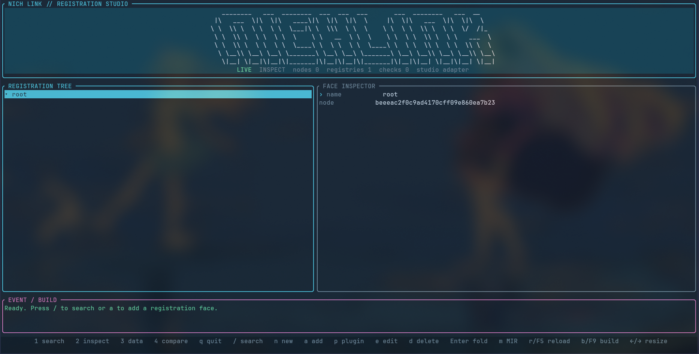

<div align="center">


<p><strong>一种顺应社区扩展本能、服务工程协作与 agentic coding 的 Rust 代码组织模型：被动式递归注册，显式边界合同，任意层级原子替换。</strong></p>

[](LICENSE)
[](.github/workflows/ci.yml)
[](Cargo.toml)

<p>
<a href="#特性"><kbd>特性</kbd></a>
<a href="#开始使用"><kbd>开始使用</kbd></a>
<a href="#注册面"><kbd>注册面</kbd></a>
<a href="#studio-与命令行"><kbd>Studio / CLI</kbd></a>
<a href="#边界"><kbd>边界</kbd></a>
</p>

</div>

💬 [Discuss the graft model](https://github.com/Nichtigott/nichlink/discussions)

项目规模越大，一次局部改动越可能波及半个仓库。NichLink 在结构层面处
理这件事：对象携带小而明确的边界；替换在接入点完成校验；每个对象的
源码位置对人和工具保持可见。

AI 辅助与 agentic coding 放大而非制造了这种压力。模型和人类评审者都
无法对大型代码库保持完整注意力，幻觉与上下文缺失是常态失效而非意外。
NichLink 因此把通常只存在于约定中的关键假设固化为可检查的结构：原子
对象、显式合同、源码溯源，以及团队可共同阅读的开发期注册图。同一套
边界同样服务于代码评审、社区协作与普通 Rust 开发——AI 是这些结构的
消费者之一，不是架构存在的理由。

这一模型也定义了社区扩展项目的方式。贡献者在原树之外交付实现，声明
所替换的边界，由宿主完成 graft 校验；相互竞争的实现可以并存，上游源
码不必沦为 patch 队列。项目保持自身形态，试验发生在命名合同之内。

NichLink 目前处于早期阶段：核心协议已可用于真实工程，静态分析与运行
时证据均显式标注自身覆盖范围。

## 特性

- **被动、递归注册。** 每个注册面在自己的文件中声明父节点，父节点只
负责接受，不维护中央子对象清单。注册面还可以拥有下一级 `Registry`，
同一规则自然递归。
- **只有一个 Registry 类型。** 根注册机和子注册机使用同一套 API；树是
注册行为产生的，不靠“根类型/叶类型”特判。
- **边界合同。** preset/parts 的输出类型和 handle 合同可以在编译期失败；
`registry_rule` 负责结构，`admission` 负责外部依赖，发布前一次收集全部
失败项。
- **原子嫁接。** 替换面向一个逻辑槽位，并且必须匹配声明的输入/输出
`FlowContract`。验证不通过时，线上注册树保持不变。
- **两步构建。** 第一阶段按宿主源码发现可达注册面，生成更小的
`StaticPlan`；之后交给正常的 rustc、LLVM 和链接器做最终代码/符号裁剪。
前者减少注册元数据和编译范围，后者负责最终机器码体积，它们不是一件事。
- **按需调试。** `off`、`errors-only`、`full` 三档追踪让发布路径默认不收集
证据。Studio 和 MCP 使用同一套注册树、调用链和数据流模型。

## 开始使用

有两种方式可以试用 NichLink。

### 方式一：安装 NichLink CLI

这种方式不会把 NichLink 源码放进你的应用目录。先安装 CLI，它提供
`nichlink` 命令（包含 Ratatui Studio 的 `nichlink studio` 子命令）：

```sh
cargo install --git https://github.com/Nichtigott/nichlink nichlink-cli
nichlink new my-app
cd my-app && nichlink studio
```

发布到 crates.io 后，可以把 Git 地址替换为 `cargo install nichlink-cli`。
插件二进制同时支持 `cargo nichlink <命令>` 形式。如果要检查已有项目：

```sh
NICH_LINK_PACKAGE_ROOT=/work/my-app nichlink studio
```

独立的 `nichlink-studio` 二进制仍可单独安装。

### 方式二：直接克隆源码运行

适合参与开发或想看最新实现，不会安装全局命令：

```sh
git clone https://github.com/Nichtigott/nichlink
cd nichlink
cargo run -p nichlink-cli -- studio
```

从源码仓库检查另一个项目：

```sh
NICH_LINK_PACKAGE_ROOT=/work/my-app cargo run -p nichlink-cli -- studio
```

Studio 中按 `n` 可以新建 binary 或 library 项目。向导只写 Cargo 清单、
薄 `build.rs` 和入口文件；按 `a` 才会创建第一个注册面。它不会凭空
生成 `control` 树。只有注册面确实需要结构规范时，旁边才会生成
`registry_rule/` 目录。

### 把 NichLink 接入自己的项目

注册声明属于宿主项目，所以 Cargo 需要一个很薄的构建入口：

```sh
# 使用 Git。nichlink-build-method 必须进入 build-dependencies。
cargo add nichlink-run-method --git https://github.com/Nichtigott/nichlink --branch main
cargo add nichlink-build-method --build --git https://github.com/Nichtigott/nichlink --branch main

# 或者，在两个本地源码仓库之间联调：
cargo add nichlink-run-method --path /path/to/nichlink/run_method
cargo add nichlink-build-method --build --path /path/to/nichlink/build_method
```

不要把 `nichlink-build-method` 同时以一种来源放进 `[dependencies]`、又以另一种
来源放进 `[build-dependencies]`。Cargo 要求同一个包在整份清单中只有一个
canonical source。

```rust
// build.rs
fn main() {
    nichlink_build_method::run();
}
```

在 crate 根部只接线一次生成计划：

```rust
nichlink_run_method::host!();
```

它展开为 `include!(concat!(env!("OUT_DIR"), "/generated_lib.rs"))`，
直接书写该 include 是等价的高级写法。`nichlink-run-method` 再导出整个
kernel，注册面代码中的合同、计划和追踪 API 都通过
`nichlink_run_method::…` 引用。

不要求必须有 `main.rs`：二进制项目以 `src/main.rs` 作为入口，前端框架
这类库项目以 `src/lib.rs` 作为入口。构建适配器扫描的是宿主自己的源码；
Cargo 不会把使用者的 `main.rs` 交给依赖 crate 的 `build.rs`，因此宿主
如果还拥有自己的注册面，就需要这一次构建接线。

## 注册面

注册面就是一个带 `#[nichlink::object]` 属性的普通 Rust `struct`。
`struct` 和 `impl` 是真正运行的实现；属性参数记录它在树中的位置，以及
什么对象可以进入或替换它。

```rust
use nichlink_run_method as nichlink;

pub struct CanvasParts;
pub struct CanvasPreset;

impl nichlink::PresetContract for CanvasPreset {
    type Output = CanvasParts;
    const REQUIRED_PARTS: &'static [&'static str] = &["paint"];
}

impl nichlink::PartsContract for CanvasParts {
    type Output = CanvasParts;
    const PROVIDED_PARTS: &'static [&'static str] = &["paint"];
}

#[nichlink::object(
    summary(zh = "二维画布", en = "A 2-D drawing surface"),
    requires("viewport" => "layout.viewport"),
    provides("canvas.frame"),
    expected_output = "CanvasFrame",
    actual_output = "CanvasFrame",
    flow = nichlink::FlowContract::new(
        nichlink::ContractId::new("canvas.render.v1"),
        1,
        "CanvasInput",
        "CanvasFrame",
    ),
)]
pub struct Canvas {
    preset: CanvasPreset,
    parts: CanvasParts,
}

impl Canvas {
    pub const EXPORTS: &'static [&'static str] = &["canvas.render"];

    pub fn render(&self, input: CanvasInput) -> CanvasFrame {
        // 这里仍然是普通 Rust 实现
        input.into_frame()
    }
}
```

大多数字段都有安全默认值。最小注册面就是
`#[nichlink::object] pub struct App;` —— 结构体名同时是 kind、默认 handle
和默认显示名。只有确实有信息时再写 `summary`、`exports`、`requires`、
`flow`，不用为了填满表格重复默认值。位于文件夹面之下的注册面可以省略
`parent`，构建阶段会按目录树推导挂载位置。

这里有三种不同的校验，故意不合并：

1. **构造合同（编译期）。** `preset` 和 `parts` 的关联输出类型必须一致；
`handle_contracts` 和 `part_contracts` 让 rustc 直接证明 handle/parts 实现了
指定 trait。
2. **注册规范（构建/发布前）。** `registry_rule` 只描述进入这个注册机的
子对象必须具备的最低结构：preset、parts、exports 和接口。它不维护 kind
白名单，也不决定谁属于这个父级。缺什么会集中报告，
不会留下半注册对象。
3. **准入门禁（依赖边界）。** `admission` 规定注册面可以使用哪些外部
注册路径。越过门禁的依赖会被拒绝，错误中会带注册面、源码位置和依赖名。

替换时，两边都要发布数据流合同。宿主先比较合同 id、版本、输入和输出，
通过后才执行嫁接：

```rust
let plan = nichlink_run_method::GraftPlan::command(
    framework,
    "cut root/canvas graft canvas_fast",
)?;
let effective = base.overlay(&plan, &external)?;
```

扩展对象只需满足目标注册规范；替换对象还必须和槽位的输入/输出合同
语义兼容。这样换的是中间实现，不是悄悄改了一个模块名。

### 结构规范是最低要求

registry_rule 是最低边界。注册面可以拥有比规范列出的更多字段、方法、
接口或 exports，但不能少掉任何必需项。规范并不表示“对象只能有这些内容”。
这对框架演进很重要：给已有注册面增加方法不会破坏旧使用者，删除必需 part
才会。

### 父级如何约束子注册面

下面是一棵只有两层的完整示例。`Control` 是父注册面，`Button` 是进入
`Control` 所拥有 Registry 的子注册面。规则属于父级，所以单独放在
`control/registry_rule/`；子级只声明自己提供了什么。

```text
src/
└── control/
    ├── control.rs                         # 父：Control
    ├── registry_rule/
    │   └── registry_rule.rs               # Control 对所有直接子级的最低要求
    └── object/
        └── button/
            └── button.rs                  # 子：Button
```

父注册面先定义共享接口，并声明自己拥有 Registry：

```rust
// src/control/control.rs
use crate::control::registry_rule::REGISTRATION_RULE;
use nichlink_run_method as nichlink;

pub struct Control;
pub struct ControlFrame;

pub trait ControlHandle {
    type Parts;

    fn paint(&self, parts: &Self::Parts) -> ControlFrame;
}

pub trait ActionPartsContract {
    fn action_id(&self) -> &str;
}

#[nichlink::object(
    needs_registry = true,
    parent = crate::root_node_id(env!("CARGO_PKG_NAME")),
    registry_rule_path = "src/control/registry_rule/registry_rule.rs",
    registry_rule = REGISTRATION_RULE,
)]
pub struct Control;
```

这里的 `needs_registry = true` 才是“Control 可以接收子对象”的声明。
`parent` 则表示 Control 自己位于包根下。它没有列出 Button；新增另一个合法
子对象时，不需要回来改 `control.rs`。

父级规则只写最低结构，不写允许进入的 kind 清单：

```rust
// src/control/registry_rule/registry_rule.rs
use crate::RegistrationRule;

pub const REGISTRATION_RULE: RegistrationRule = RegistrationRule::new()
    .require_preset("ActionParts")
    .require_parts(&["label", "action"])
    .require_exports(&["control.render"])
    .require_handle_traits(&["ControlHandle"])
    .require_part_traits(&["ActionPartsContract"]);
```

一个能通过这份规则的 Button 如下：

```rust
// src/control/object/button/button.rs
use crate::control::{ActionPartsContract, ControlFrame, ControlHandle};
use crate::{PartsContract, PresetContract};
use nichlink_run_method as nichlink;

pub struct ActionParts;

pub struct ButtonParts {
    pub label: String,
    pub action: String,
    pub tooltip: Option<String>, // 父规则没要求，但允许多提供
}

impl PresetContract for ActionParts {
    type Output = ButtonParts;
    const REQUIRED_PARTS: &'static [&'static str] = &["label", "action"];
}

impl PartsContract for ButtonParts {
    type Output = ButtonParts;
    const PROVIDED_PARTS: &'static [&'static str] = &["label", "action", "tooltip"];
}

#[nichlink::object(
    parent = crate::control::NODE_ID,
    handle_traits = ["ControlHandle"],
    handle_contracts = [crate::control::ControlHandle],
    part_traits = ["ActionPartsContract"],
    part_contracts = [crate::control::ActionPartsContract],
)]
pub struct Button {
    preset: ActionParts,
    parts: ButtonParts,
}

impl Button {
    pub const EXPORTS: &'static [&'static str] = &["control.render"];
}

impl ControlHandle for Button {
    type Parts = ButtonParts;

    fn paint(&self, parts: &Self::Parts) -> ControlFrame {
        let _ = (&parts.label, &parts.action);
        ControlFrame
    }
}

impl ActionPartsContract for ButtonParts {
    fn action_id(&self) -> &str {
        &self.action
    }
}
```

注册面就是普通结构体；`parent = crate::control::NODE_ID` 把它挂到 Control
的 Registry 下。省略 `parent` 时，构建阶段按目录树推导挂载位置，所以把
Button 误接到另一个 Registry 会在生成代码前失败。

这份声明会经过四层验证：

| 检查 | 由谁执行 | 在本例中验证什么 |
| --- | --- | --- |
| 父子拓扑 | `nichlink-build-method` | Button 的目录位置和 `parent` 是否都指向 Control |
| Rust 类型合同 | rustc | `ActionParts::Output` 与 `ButtonParts::Output` 是否同为 `ButtonParts`；两个真实 trait impl 是否存在 |
| 父级注册规范 | 构建聚合诊断、生成代码的 const 检查，以及开发态 Registry | preset、parts、export 和接口是否不少于 Control 的规则 |
| 外部准入 | Registry 连接器 | Button 的跨树 `requires` 是否落在 Control 允许的 `admission` 路径内 |

`handle_traits` / `part_traits` 是可存入注册元数据的接口名；对应的
`handle_contracts` / `part_contracts` 是 Rust trait 路径，负责让 rustc 证明
`impl` 真的存在。前者供规则和工具读取，后者不创建 trait object 或 vtable。

下面的子声明故意不合格。假设 `WrongPreset` 和 `BrokenParts` 已经实现了输出
类型相同的 `PresetContract` / `PartsContract`，这样错误只聚焦在父规则：

```rust
#[nichlink::object(parent = crate::control::NODE_ID)]
pub struct BrokenButton {
    preset: WrongPreset,
    parts: BrokenParts,
}

impl BrokenButton {
    pub const EXPORTS: &'static [&'static str] = &["control.preview"];
}
```

一次 `cargo check` 会在同一份 NichLink 诊断中列出错误声明的源码位置，以及
缺少的 `ActionParts` preset、`control.render` export、`ControlHandle` 和
`ActionPartsContract`。如果只从 `BrokenParts::PROVIDED_PARTS` 删除 `action`，
生成代码的 const 检查会拒绝缺失的结构 part；如果保留
`handle_contracts = [crate::control::ControlHandle]` 却删除真实 impl，rustc 会在
声明点给出 trait bound 错误。这三条路径分别处理“声明缺项”“结构常量缺项”
和“Rust 实现不存在”，不会伪装成同一种错误。

父子归属不由规则筛选 kind，外部对象能否被调用也不由规则决定：

| 层次 | 负责的问题 |
| --- | --- |
| Rust `struct` / `impl` | 对象真正如何工作 |
| `parent`（省略时由目录位置推导） | 对象注册到哪里 |
| `registry_rule` | 进入父 Registry 的对象至少长什么样 |
| `admission` | 这个分支允许依赖哪些外部路径 |
| `FlowContract` | graft 接口两端的数据是否兼容 |

早期原型里的 `RegistrationRule::new(&["Button"], &[])` 已经删除。迁移时改成
`RegistrationRule::new()`，只追加上面这些最低结构要求。外部分支的 allow/deny
移到 `Admission`；旧的 kind 列表不需要搬过去，因为 kind 从来不负责确定父子关系。

### 输出增加内容时如何兼容

当前 FlowContract 会比较稳定的合同 id、版本，以及声明的输入/输出标签；
它不会从 Rust 类型自动推断字段级协变。如果新实现返回了更多内容，可以明确
选择一种做法：

- 保持相同的输出标签，在稳定 envelope（例如 CanvasFrame）中增加向后兼容
的可选字段；
- 发布新的合同版本（例如 CanvasFrame v2），一次更新所有消费者边界；或
- 增加一个适配注册面，把更丰富的输出转换回旧合同。

后两种做法会把受影响的边界显式留下，而不是静默丢弃数据。只有选定的边界
合同和目标注册规范都通过，graft 才会接受替换。

### 单个 graft 与协调 graft 集

注册树描述的是对象归属，并不等于完整的数据流图。requires 可以解析到
另一条分支上的 provider，运行时数据边也可能跨过多个注册边界。当一次替换
会影响多个消费者时，把受影响的槽位组成一个计划，一起提交。

graft 的三个参与者始终分开。框架原树和第三方实现各自留在原 crate；宿主只在
自己的 `main.rs` 或 `lib.rs` 中声明覆盖计划：

```text
framework crate                         external graft crate
src/                                    src/
└── control/                            └── button_fast/
    ├── control.rs                          └── button_fast.rs
    └── object/button/...                        │
             │                                   │
             └──── immutable base Registry       └──── external Registry
                                  \               /
                                   GraftPlan + overlay
                                            │
                                    effective Registry
                                            │
                                  host crate: src/main.rs
```

宿主入口只声明切口与外部 selector，不复制框架或第三方源码。静态宏本身
不构造 `Vec` 或 `String`；构建器会把内容直接写进 `StaticPlan`：

```rust
use nichlink_run_method::{FrameworkId, Registry};

const FRAMEWORK: FrameworkId = FrameworkId::new("nichui");

nichlink_run_method::static_graft_plan!(FRAMEWORK,
    cut "root/control/button" graft "button_fast",
);

fn registry_for_this_run(base: &Registry, external: &Registry) -> Registry {
    base.overlay_static(builtin_static_plan().grafts(), external)
        .expect("checked graft")
}
```

`overlay` 返回一棵新的 effective Registry。`base` 和 `external` 都不会被修改；
任一切口的 flow contract、目标父规则、admission 或连接器检查失败，整组计划
都不会发布。`overlay_static` 省掉动态 `GraftPlan` 及其 selector 字符串分配；
外部实现若在运行时才加载，effective Registry 的校验和构造仍然只做一次。

普通 cut 只换一个节点，原节点的子树继续接在新实现下面：

```text
base                              cut A/a1 graft a1_fast
A                                 A
├── a1                            ├── a1_fast       # 只替换 a1
│   ├── b1                        │   ├── b1         # 从 base 继承
│   └── b2                        │   └── b2         # 从 base 继承
├── a2                            ├── a2
└── a3                            └── a3
```

`full` 明确丢弃原节点的整棵子树，改用外部实现携带的子树：

```text
external                          cut A/a1 full graft a1_fast
a1_fast                           A
└── bx                            ├── a1_fast
                                  │   └── bx         # 来自 external
                                  ├── a2
                                  └── a3
```

需要同时修改多个数据边界时，把切口写在同一个静态声明里：

```rust
nichlink_run_method::static_graft_plan!(FRAMEWORK,
    cut ["root/canvas"] graft "canvas_fast",
    cut ["root/hit_test"] graft "hit_test_fast",
    cut ["root/layout"] graft "layout_fast",
);
```

只有编辑器、命令行或热加载流程需要在运行时创建和修改计划时，才使用返回
动态 `GraftPlan` 的 `graft_plan!`。

也可以选择同一父 Registry 下的一段兄弟节点：

```rust
let plan = nichlink_run_method::GraftPlan::command(
    framework,
    "cut [root/a1 to root/a3] graft replacement",
)?;
let effective = base.overlay(&plan, &external)?;
```

返回的 effective registry 保留原树和外部树不变，维持目标的逻辑路径，自动继承
未覆盖的兄弟，并在发布前重新执行目标注册规范、准入和连接器校验。

Studio 的 graft 流程使用 `g`：它创建
`.nichlink/external-grafts/<selector>/graft.plan`，并用默认编辑器打开计划，
宿主源码不会被修改。系统不存在复制或替换宿主源码的 graft 路径。

NichLink 不限定对象内部采用哪种编程范式。普通函数、trait、泛型、闭包、
依赖注入或消息传递都可以继续使用；注册面只约束它们对外暴露的边界。声明过
的 `requires/provides` 和 `FlowContract` 会在注册、连接和 graft 时自动校验。
改动实现本身不会因为“代码和以前不一样”而失败；只有某个输入找不到合法
provider、跨过 admission 门禁，或替换端无法接回原数据流时才会失败。错误会
指出断开的 capability、消费端、候选 provider、源码位置和失败阶段，而不是只给
一句“注册失败”。这不等于猜测任意 Rust 函数内部所有未声明的数据流。

## 发布静态化、性能与两阶段修剪

NichLink 的两阶段修剪解决两个不同问题。

第一阶段发生在 rustc 展开生成模块之前，颗粒度是整个注册面：

1. 宿主 crate 的薄 `build.rs` 调用 `nichlink-build-method`；
2. 构建器读取目录注册面以及 `main.rs`、`lib.rs` 或 `application!` 指定的入口；
3. 它保守推导本 crate 需要的注册面，只把这些面写入生成模块和 `StaticPlan`；
4. 遇到无法静态证明的动态分发、生成代码或路径时，回退全树，而不是误删代码。

这一步能减少送进 rustc 的注册面和元数据，但它不是完整 rustc 调用图，也不裁剪
一个活跃注册面内部的单个函数。

第二阶段由正常 Rust 工具链完成。rustc 的可达性和单态化、LLVM、ThinLTO 与
链接器垃圾回收继续删除未引用函数和符号。workspace 的 release profile 已启用
ThinLTO 和单 codegen unit；`tools/nichlink-release-audit` 会检查发布产物、拒绝
残留的 `.inventory` linker section，并可对比 full/minimal 二进制的符号和字节数。
NichLink 不用源码函数名匹配冒充编译器级精确裁剪。

发布态也不再启动时重建内置注册树。生成代码把通过检查的拓扑固化成
`&'static [StaticFace]`，把编译前声明的 graft 固化成同一 `StaticPlan` 内的
`&'static [StaticGraftCut]`。`builtin_static_plan()` 直接借用这些只读数据：没有
堆分配、全局 constructor、inventory 遍历或启动时注册循环。构建期
`registry_rule` 检查也不会变成每帧执行的运行时逻辑。

但“静态化”等于成本清楚，不等于所有场景绝对零成本：

| 使用方式 | 运行时保留什么 | 成本边界 |
| --- | --- | --- |
| 只读内置拓扑 | `StaticFace` 静态切片 | 启动零分配；`find` 为二分查找 O(log n)，`children_of` 当前为 O(n) 过滤 |
| 开发态可变 Registry | `Arc` header、32 页 entries 和索引 | clone 只增加 `Arc` 引用；首次修改只复制命中的页，不复制整棵树 |
| 编译前静态 graft | `StaticPlan` 内的静态 selector 切片 | 声明读取零分配；框架若已静态绑定实现，不需要构造 Registry overlay |
| 发布后启用 plugin/graft | 所选动态元数据和 effective Registry | `overlay_static` 不分配计划，但仍要做一次合同、准入和连接器检查 |
| `CallTrace::runtime()` | debug 默认 `errors-only`，release 默认 `off` | off 不收集证据；应用仍显式调用追踪 API 时，不承诺指令级零开销 |

因此，先前担心的 Registry 复制页不会出现在“只使用内置静态计划”的发布启动
路径；只有应用明确构建可变 Registry、启用运行时插件或执行 graft 时才使用页级
COW。类似地，Studio、MCP、debug 和 plugin-host 是独立工具或可选依赖，应用
没有链接它们就不会出现在最终二进制里。

NichLink core 不会重写任意 Rust 调用点。所谓“静态绑定实现”需要框架自己的
生成层按 selector 选择具体 Rust 类型或函数；NichLink 提供经过验证的静态选择
数据。运行时插件没有可提前链接的实现，所以仍需要一次 overlay。这条区分避免
为了追求“零开销”而把动态插件能力说成编译期魔法。

性能数字与硬件、文件系统和注册面内容相关，仓库提供复现实验而不写死营销数字：

```sh
# 构造并索引大树
cargo run --release -p nichlink-run-method --example scale_audit -- 100000

# fmt、测试、Clippy、文档、release 产物、符号和 linker section
tools/nichlink-release-audit

# 可选：提供两个实际应用产物，生成大小与符号差异
NICH_LINK_FULL_BINARY=/path/to/full \
NICH_LINK_MINIMAL_BINARY=/path/to/minimal \
tools/nichlink-release-audit
```

## Studio 与命令行

Studio 是常驻的 Ratatui 界面，不是不断向终端追加文本的脚本。它使用
备用屏幕，监听项目文件，只有输入、窗口变化或文件事件发生时才重绘。



| 按键 | 操作 |
| --- | --- |
| `n` | 新建 binary/library 项目 |
| `a` / `e` / `d` | 添加、编辑、删除注册面 |
| `g` | 为选中注册面创建并编辑外部 graft 计划 |
| `/` | 搜索文件和函数 |
| `1`–`4` | 搜索、检视、数据、对比页面 |
| `Tab` | 在树和详情之间切换焦点 |
| 方向键 / `j` `k` | 移动选择或调整当前面板 |
| `r` / `F5` | 重新加载项目 |
| `b` / `F9` | 执行构建检查 |
| `q` / `Ctrl-C` | 退出 |

开发 Studio 自身时，可以让监督器在源码变化后重建并重启子进程：

```sh
NICH_LINK_PACKAGE_ROOT=/work/my-app \
  cargo run -p nichlink-studio --bin nichlink-dev -- watch
```

命令行入口刻意保持精简：`nichlink` 是统一入口——`nichlink new` 生成宿主
项目，`nichlink check` 不做完整编译即可运行注册发现与校验，`nichlink
build` 先校验注册树再调用 `cargo build`，`nichlink studio` 负责交互式编辑
和调试，`nichlink mcp` 是给 AI 客户端使用的只读 JSON-RPC/MCP 桥。`cargo
check` 仍是构建校验命令：

```sh
cargo check
NICH_LINK_PACKAGE_ROOT=/work/my-app nichlink mcp
```

MCP 提供 `nichlink.search`、`nichlink.inspect`、`nichlink.callgraph`、
`nichlink.read` 和 `nichlink.status`。静态调用图会标为 heuristic；动态调用
和运行时数值以 `CallTrace` 的现场证据为准。

## 什么时候值得用 NichLink

NichLink 不是 Rust 模块系统的替代品。它适合这样的项目：对象图由多人或
工具共同维护；需要替换中间层而不改动相邻节点；或者 AI 需要一份机器能读
懂的“这个对象接受什么、提供什么”的说明。小型、集中组装的应用通常直接
使用普通 Rust 更合适。

## 对比

| 方案 | 擅长解决 | 仍需应用自己处理 |
| --- | --- | --- |
| 模块、trait、依赖注入 | 命名空间、静态行为、显式构造 | 发现、父链闭合、准入、替换策略 |
| `inventory` / `linkme` | 分布式收集静态条目 | 树语义、合同、溯源、原子嫁接 |
| Bevy 风格插件 | 显式组合一个应用 | 通用源码路径和中间层合同校验 |
| CodeGraph / CodeQL | 符号和调用证据 | 运行时注册与替换决策 |
| NichLink | 被动递归注册树、合同、准入、嫁接校验、Studio/MCP 视图 | 动态分发和优化后数值仍受 Rust/编译器边界限制 |

## 边界

- 第一阶段粗修只能看到宿主 crate 的源码，看不到下游应用的 `main.rs`；
最终二进制仍由 rustc/LLVM/链接器按可达性裁剪。
- MIR 和静态扫描提供候选证据。`dyn Trait`、函数指针、FFI、运行时选择
的调用和宏生成代码，可能只能保守保留或依赖现场证据。
- 优化后的未插桩局部变量可能显示为 `unobserved`；需要真实数值时启用
`full` 追踪。
- 进程插件能隔离崩溃和资源限制，但不是操作系统级安全沙箱。Wasm/进程
加载都是可选能力。
- Studio、debug、MCP 和 plugin-host 都是可选工具；只使用 core 时，发布
产物不包含开发界面。

## 运行时追踪

```rust
let trace = nichlink_run_method::CallTrace::runtime(); // debug: errors-only, release: off
let quiet = nichlink_run_method::CallTrace::disabled();
let detailed = nichlink_run_method::CallTrace::full();
```

`errors-only` 只保留失败链路并丢弃成功证据；`full` 保留 frame、局部变量和
数据边，供 Studio/MCP 查看。发布构建默认不收集，除非应用明确选择。

## Kernel 与执行面

NichLink 把 workspace 分成一个纯 kernel 和一组薄执行面。下沉规则很简单：
**无 I/O、无 `std::env`、无时间/进程绑定的逻辑一律下沉到 kernel**；凡是
要读文件系统、起进程或驱动终端的能力，都留在执行面里，由执行面把 kernel
方法绑定到各自的上下文。

`nichlink-core`（lib 名 `nichlink`）是 kernel：协议名词加纯方法全集——身份、
声明、解析、树操作、策略、渲染。kernel 内不做任何 I/O，也不绑定环境，因此
每个工具复用的都是同一套方法。

| Crate | 目录 | 执行面职责 |
| --- | --- | --- |
| `nichlink-build-method` | `build_method/` | 构建期文件系统与 `OUT_DIR` 编排：扫源、kernel 校验、`generated_lib` 渲染、manifest/缓存写入、cargo 指令 |
| `nichlink-run-method` | `run_method/` | 运行期状态与追踪：`CallTrace` 帧栈/数据边、`host!`/`trace_call!` 宏、authoring 执行器 |
| `nichlink-debug-method` | `debug_method/` | 观测证据面：inventory 收集、MIR 子进程编排、tracing/petgraph 适配、`UnifiedCallGraph` |
| `nichlink-plugin-host` | `plugin-host/` | 插件宿主执行：wasm/进程沙箱实例、世代部署、懒激活槽位表 |
| `nichlink-studio` | `studio/` | TUI 执行面：渲染与键鼠状态机，消费 kernel 查询与 authoring 方法 |
| `nichlink-mcp` | `mcp/` | AI 代理 stdio 桥：JSON-RPC 循环、工具分发、路径防护 |
| `nichlink-cli` | `cli/` | 进程胶水：argv 分发、cargo 子进程、子命令转发 |

## 工作区结构

```text
core/         nichlink-core（kernel）：协议名词 + 纯方法全集——identity、
              declaration、diagnostic、tree、plugin、mir、requirements、
              release、source、authoring、syntax
build_method/ nichlink-build-method：构建期源码发现、缓存、第一阶段 StaticPlan
run_method/   nichlink-run-method：运行期 trace 状态、host!/trace_call! 宏、
              authoring 执行器
debug_method/ nichlink-debug-method：可选 CallTrace 适配、MIR 证据、数据流与图模型
cli/          nichlink-cli：统一入口（nichlink new/check/build/studio/mcp、cargo-nichlink）
studio/       Ratatui 编辑、搜索、watch 和源码跳转
mcp/          面向 AI 的只读 MCP 桥
plugin-host/  可选 Wasm/进程插件和原子部署
```

技术路线见 [`docs/ROADMAP.zh-CN.md`](docs/ROADMAP.zh-CN.md)，英文版见
[`docs/ROADMAP.md`](docs/ROADMAP.md)。每个 crate 的 API 说明放在各自目录。

## 构建与许可证

```sh
cargo fmt --all
cargo test --workspace --offline
cargo clippy --workspace --all-targets -- -D warnings
```

NichLink 使用 [MIT License](LICENSE)。欢迎提交真实项目中的失败案例、设计
质疑和改进 PR，也欢迎在 GitHub Issues / Discussions 讨论边界问题。

[English](README.md) · [Roadmap](docs/ROADMAP.md) · [中文路线图](docs/ROADMAP.zh-CN.md)
